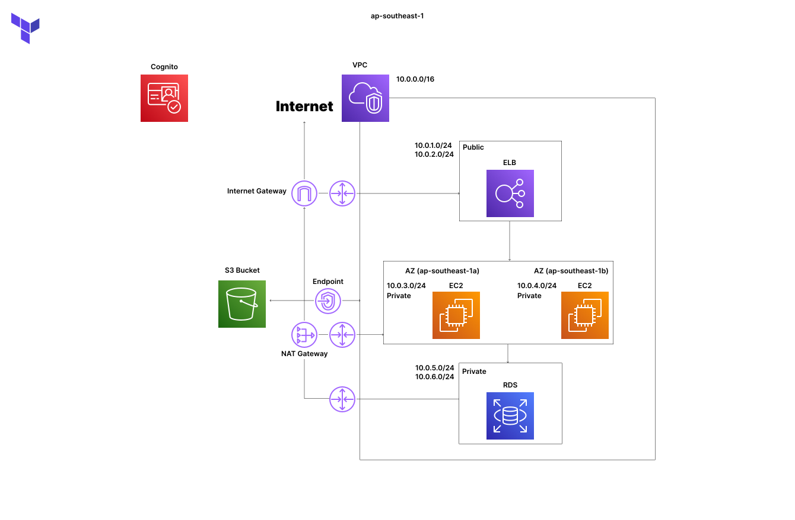

# Infrastructure

| Folder   | Description                                         |
| -------- | --------------------------------------------------- |
| ec2      | Terraform IaC AWS EC2 instance                      |
| s3       | Terraform config AWS S3 bucket                      |
| key_pair | Terraform key pair ssh key connection               |
| sg       | Terraform security group of AWS EC2 instance config |
| vpc      | Terraform AWS VPC                                   |
| cognito  | Terraform Cognito configuration                     |

